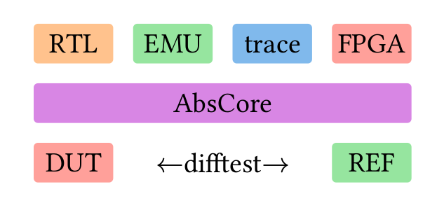
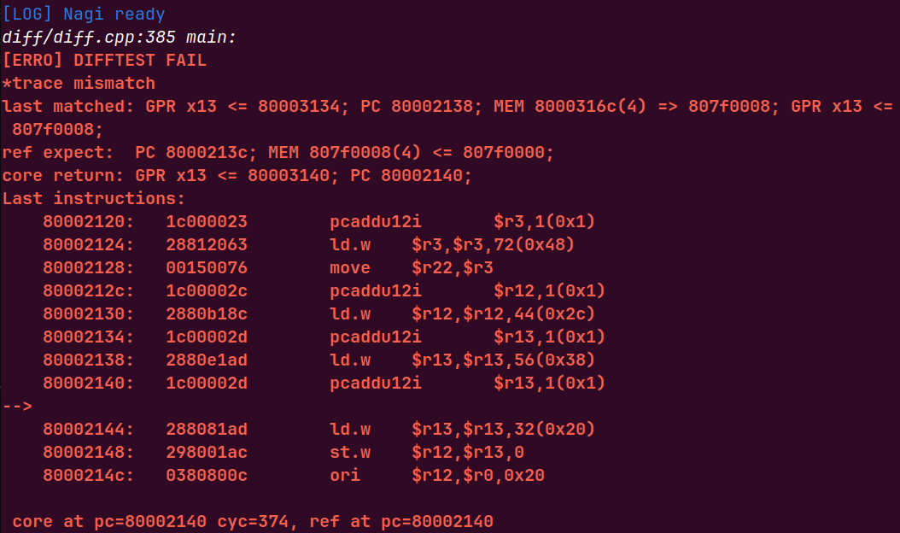
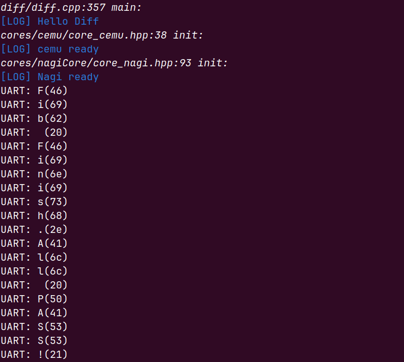
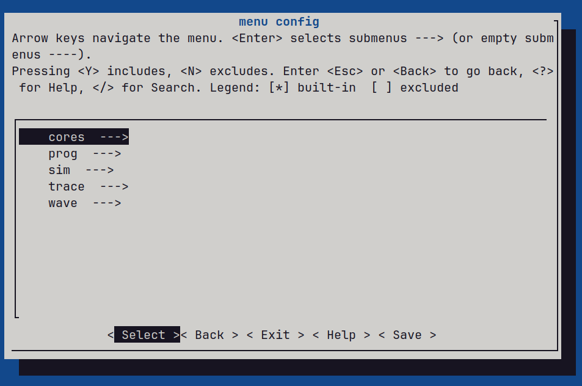
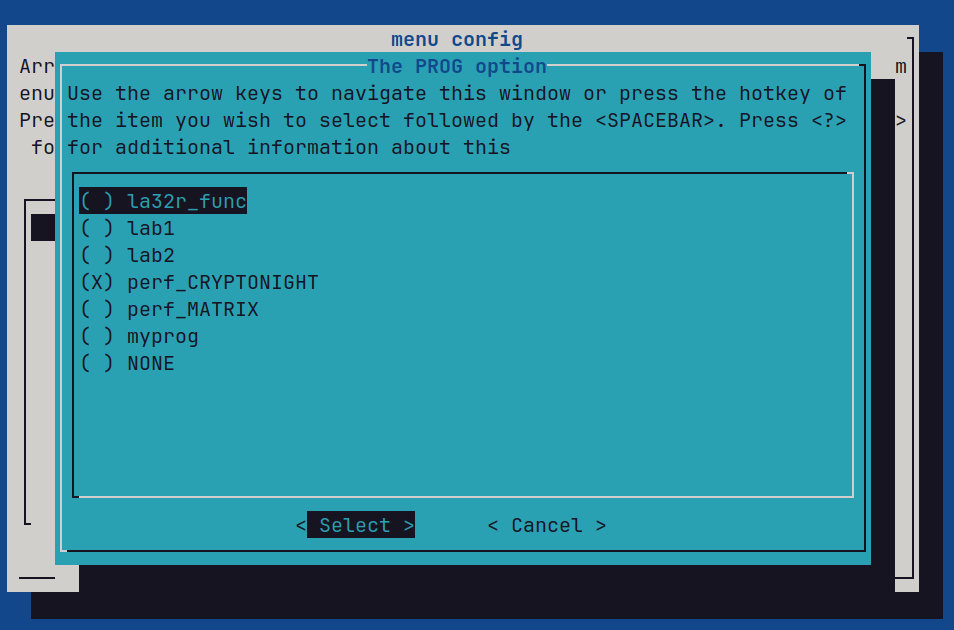

# 凪(Nagi) 敏捷开发框架



## Intro

凪(Nagi，意为“风平浪静”)，是一个基于difftest改进的CPU敏捷开发框架，有以下特性：
- 更**细粒度**的跟踪：跟踪GPR读写事件、PC改变事件、访存读写事件，提供更精确的diff报错
- 基于**事件**而非状态的跟踪：更少的性能开销、与微架构解耦的跟踪方式
- 基于统一的**处理器抽象模型**：通过处理器抽象模型，让模拟器、RTL乃至FPGA、trace log能够大一统，difftest主函数只与抽象模型有关，新加入的目标只需要适配抽象模型即可开始difftest，从而实现“开发一次，difftest所有”
- 更现代的**构建系统**：使用[XMake](https://xmake.io/)进行构建，相较于Makefile/CMakefile，性能更好，可读性更好
- 更友好的diff报错提示和僵死报错

Nagi为2024年龙芯杯个人赛而设计，已实现：
- 基于Verilator的RTL仿真核(`nagiCore`)
- 基于DPIC接口的性能计数器分析报告
- [CEMU](https://github.com/cyyself/cemu)模拟器的接入（可作为Golden Model）
- 两种调试波形文件记录方式：
  - 持续记录：持续记录波形，直到达到可配置的最大周期数后，清空波形文件，重新开始记录，如此往复
  - 触发记录：在可配置的特定周期时开始记录，直到达到可配置的最大周期数后，停止记录
- 负载程序运行：
  - 《CPU 设计实战：LoongArch 版》书中的`func`测试程序（即实践任务）仿真
  - 龙芯杯个人赛一级测评程序`lab1`，二级测评程序`lab2`，以及性能测试程序`CRYPTONIGHT`和`MATRIX`包括外设的完整仿真运行
  - 用于2024年现场决赛的汇编+C语言混合编程环境

## 使用说明

本项目开源的目的是提供一种思路和一种可能的实现，并不能完全开箱即用，您需要仿照`cores/nagiCore`进行您处理器核的接入。由于时间关系，无法形成详尽系统的文档，同时可能存在一些比赛时的硬编码和奇怪的代码风格，望谅。

请先安装所需要的XMake、Verilator、GTKWave 等依赖软件和库，运行环境Linux(如Ubuntu 22.04 LTS)

```bash
# 打开TUI进行配置
make config
# 运行difftest
make test
```

## 截图








